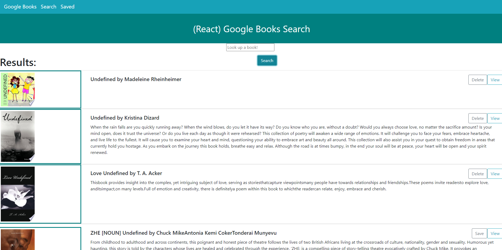
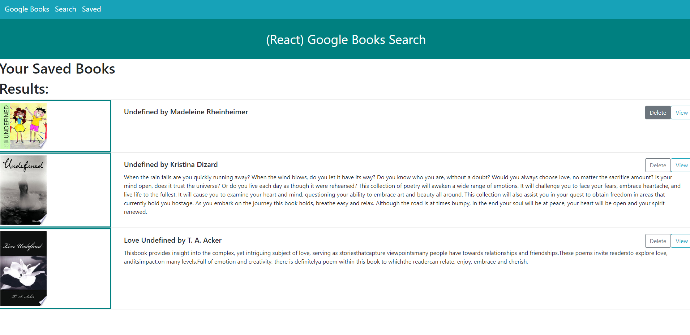
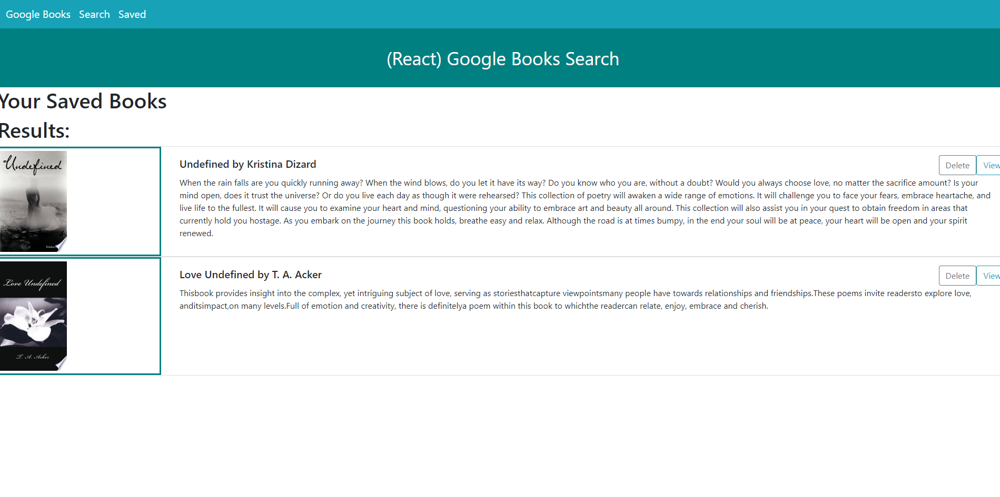

# Google Books

## Table of Contents
1. [Description](#description)
2. [Installation](#installation-instructions)
3. [Usage](#usage-information)
4. [Contribution](#contribution-guidelines)
5. [Questions & Contact](#questions-and-contact-information-below)
### Description
This app is designed to help aid and assist users in finding potential books that they would be interested in reading. After finding books by being searched up via name or key word, the title, author, image of the book, and a brief description will be displayed for all results returning from the search query. 

### Installation Instructions
Download react and all associated node_modules or use the link for heroku to use at your own leisure

### Usage Information
Use "npm start" to start up the app or use the link for heroku and begin to search your designed books

### Contribution Guidelines
See contact information

### Questions and Contact Information Below
#### Github Username: crystalcrandall92
#### Github Link: https://github.com/crystalcrandall92
#### Heroku Link: https://damp-sierra-29505.herokuapp.com/
#### Email: crystalcrandall92@yahoo.com

